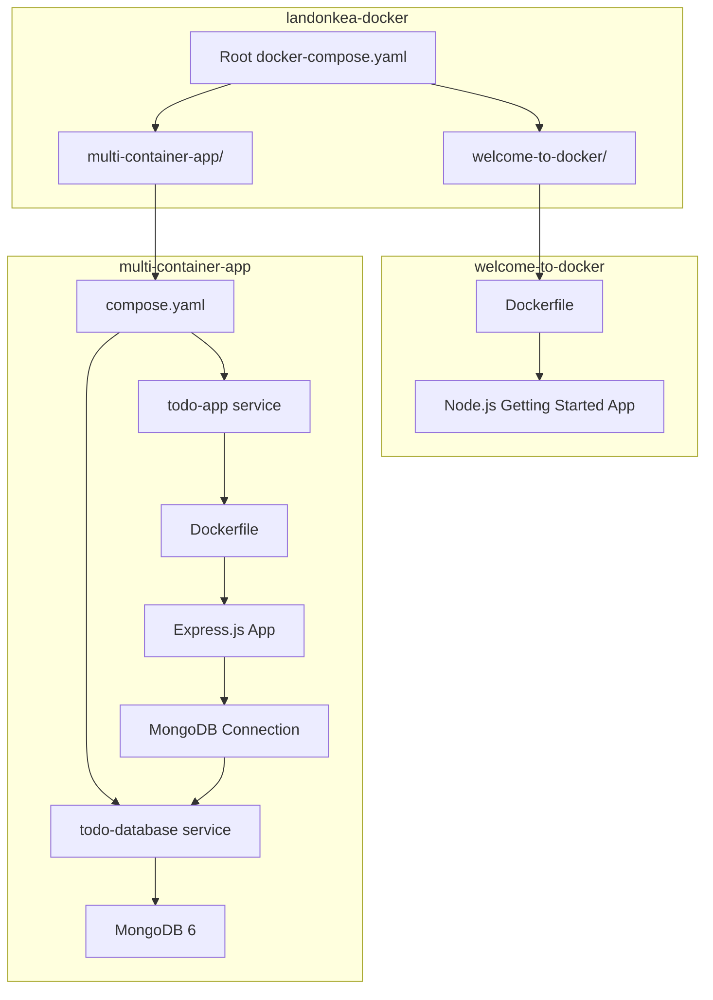
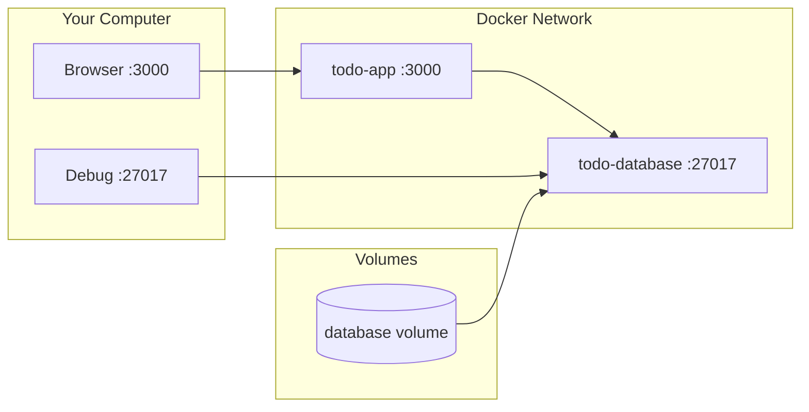
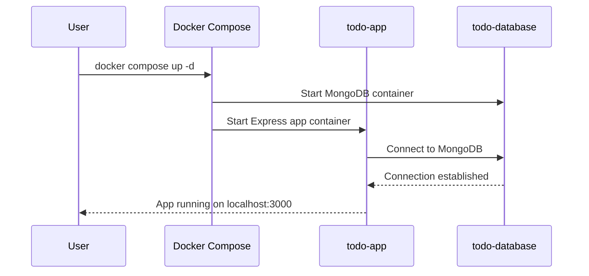
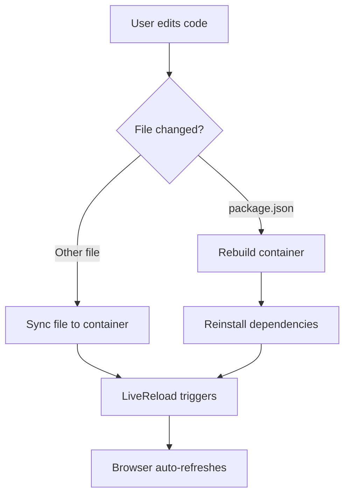

# landonkea-docker — Design & Workflow

## High-Level Overview

## Container Architecture

## Granular Workflow: Multi-Container App

## Granular Workflow: Development Mode

## File Relationships

| File | Purpose | Used By |
|------|---------|---------|
| `docker-compose.yaml` (root) | Simple Nginx web server | User (learning) |
| `multi-container-app/compose.yaml` | Todo app + MongoDB | User (learning) |
| `multi-container-app/app/Dockerfile` | Build Express app | `compose.yaml` |
| `multi-container-app/app/server.js` | Express server entry | Docker |
| `multi-container-app/app/config/keys.js` | MongoDB connection config | `server.js` |
| `welcome-to-docker/Dockerfile` | Docker tutorial image | User (learning) |

## draw.io

[Open in draw.io](https://app.diagrams.net/#RContainer%20architecture%20diagram)
